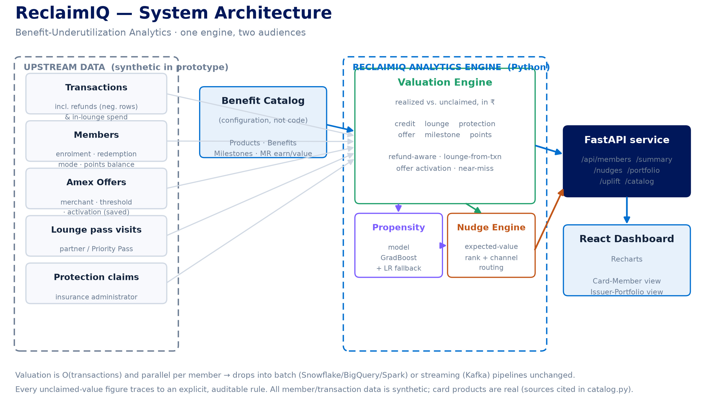
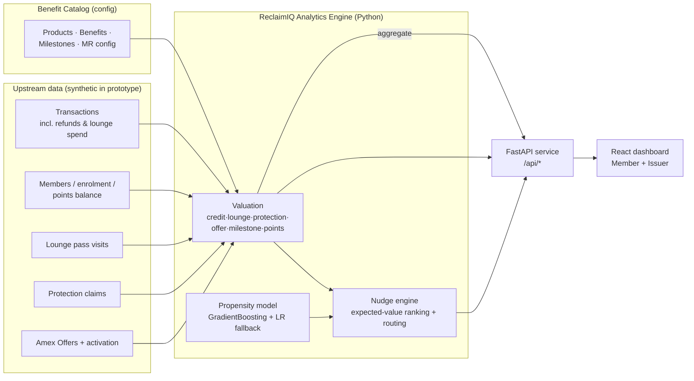

# ReclaimIQ — Benefit-Underutilization Analytics
### CodeStreet 2026 · American Express · Round 1 Project Description

---

## 1. Problem

American Express India cards bundle thousands of rupees of value into every membership —
statement credits, airport-lounge access, purchase/travel protection, targeted **Amex
Offers**, spend-unlocked **milestone rewards**, and **Membership Rewards points**. Yet:

- **Issuers can't measure the gap.** There is no single rupee figure for *how much benefit
  value goes unclaimed*, so it is hard to justify benefit spend or prove ROI.
- **Members don't see what they're missing.** Unused benefits silently erode perceived card
  value, satisfaction and retention.

The value is already paid for (in the annual fee and program cost). The problem is
**visibility and activation**, not entitlement.

## 2. Our solution — in one line

> An analytics engine that puts a **defensible rupee figure** on every member's unclaimed
> benefits across six families, and a **propensity-ranked nudge system** that turns that gap
> into measurable engagement — surfaced through a **member-facing** value view and an
> **issuer portfolio** dashboard.

We call it **ReclaimIQ**.

## 3. Grounded in the real AmEx India line-up

The benefit catalog models **real, current (2026) American Express India products** — no
invented benefits. Figures are captured as configuration with sources cited inline in
`backend/app/engine/catalog.py`.

| Card | Annual fee | Modeled entitlements |
|------|-----------|----------------------|
| **Platinum Charge** | ₹66,000 | Unlimited Global Lounge Collection; ₹25,000 travel + ₹10,000 FHR + ₹5,000 dining credits; purchase/travel protection; ₹20L renewal voucher; 1 MR/₹40 |
| **Platinum Travel** | ₹5,000 | Milestones ₹1.9L→7,500 MR, ₹4L→10,000 MR, ₹7L→22,500 MR + ₹10,000 Taj voucher *(post 09-Mar-2026 structure)*; domestic lounge (8/yr); travel insurance; 1 MR/₹50 |
| **Membership Rewards (MRCC)** | ₹4,500 | Monthly milestones (1,000 MR for 4×₹1,500 txns; 1,000 MR for ₹20,000 spend, enrolment-based); purchase protection; 1 MR/₹50 |
| **SmartEarn** | ₹495 | 10X/5X accelerators (Zomato, Flipkart, Uber, Amazon… with monthly point caps); ₹500 vouchers at ₹1.2L/₹1.8L/₹2.4L; 1 MR/₹50 base |

## 4. How it works

### 4.1 Entitlement mapping (Task 1)
A benefit **catalog** maps `member → product → full entitlement set`. Each entitlement
carries the metadata needed to match transactions and value the gap: family, reset cadence,
rupee cap, eligible categories/merchants, coverage rate, lounge allotment, milestone
thresholds, and Membership Rewards earn rate. Mapping is deterministic and auditable.

### 4.2 Rupee valuation of the gap (Task 2) — six families
Realized vs. entitled value is computed over a **trailing 12-month** window (a proxy for the
cardmembership year):

- **Credits** — `realized = max(0, min(cap, qualifying spend NET OF REFUNDS))` per cycle.
  Only spend at qualifying merchants/categories counts, and **refunds/reversals are netted
  out** so a returned purchase never counts a credit as used.
- **Lounge** — visits are **detected from card transactions inside lounges** (e.g. a
  ₹400 spend at *"Centurion Lounge BOM"*) **and** from pass-swipe records; `potential =
  reachable travel days × value/visit` (attach rate + annual cap); `realized = detected
  visits`.
- **Protection** — `expected recoverable = coverage rate × eligible protected spend`, net of
  filed claims — a probabilistic *value at risk*, reported separately so we never overstate.
- **Amex Offers** — targeted, per-member offers with an **activation (save-to-card) state**.
  If a member spends past the threshold at the offer merchant **without activating**, the
  reward is **missed leakage**; activated-but-unmet offers near expiry are surfaced as
  *at-risk* nudges.
- **Milestones** — spend-threshold rewards. Achieved / **near-miss** (within 15% of the
  threshold → recoverable) / **lost-to-non-enrolment** (threshold crossed but enrolment
  required and missing) / locked. Powers the *"you're ₹X away from unlocking ₹Y"* nudge.
- **Points** — Membership Rewards balance valued across a **redemption range**: statement
  credit (₹0.25/pt) → hotel transfer (₹0.50/pt) → airline premium cabin (₹1.50/pt). The
  *under-redemption gap* (e.g. hoarding, or burning at statement-credit rate) becomes a nudge.

Every rupee traces to an explicit rule → **defensible and explainable**.

### 4.3 Personalized surfacing (Task 3)
A React dashboard with two lenses:
- **Card Member:** hero *"value left on the table"*, breakdown by family, a points
  value-range panel, milestone progress bars, an Amex Offers panel (missed / at-risk), a
  unified ranked opportunity list, and expected-value-ranked nudges.
- **Issuer Portfolio:** total & average unclaimed, utilization distribution, leakage by
  family and product, reward-points value at stake, a prioritized outreach leaderboard, and
  the nudge-uplift study.

### 4.4 Nudge logic at the right moment (Task 4)
Each gap becomes a nudge that is **triggered** by an observable pattern (un-activated offer,
near-miss milestone, unused lounge on travel days, idle points, expiring credit),
**ranked** by **expected recovered value = rupee gap × P(convert | nudge)**, and **routed**
by intent (urgent/time-boxed → push, transactional → in-app, awareness → email) with a
recommended send window.

### 4.5 Testing & optimization (Task 5)
- **Entitlement-mapping accuracy:** deterministic rules; utilization reconciles
  (realized + unclaimed = entitlement) per benefit.
- **Nudge relevance:** a gradient-boosted propensity model (scikit-learn) trained on a
  labelled nudge log — **AUC ≈ 0.64**, **top-decile lift ≈ 1.54×** over a **25.6%** base
  conversion rate, with a transparent logistic-regression fallback.
- **Measurable uplift:** for a fixed nudge budget (20% of opportunities), model-targeting
  recovers **4.29× more value** than random/blanket targeting.

> *Note on the synthetic label:* the `converted` flag in `nudge_history.csv` is drawn from a
> known logistic formula of interpretable drivers (engagement, gap size, urgency, category
> affinity, channel). The model **re-learns that signal** — so metrics demonstrate the
> pipeline and ranking mechanics, not a real-world effect size.

## 5. Portfolio snapshot (this synthetic book of 400 members)

- **₹50.1 L** total annualized unclaimed value · **₹12,519** average per member ·
  **63.5%** portfolio utilization · **114** members under 25% utilized.
- Leakage concentration: **Lounge ₹33.5 L**, **Milestones ₹10.6 L**, **Protection ₹2.2 L**,
  **Credits ₹2.2 L**, **Offers ₹1.6 L**.
- **₹42.0 L** of Membership Rewards value sits in member accounts (valued at transfer rate),
  reported separately from unclaimed benefits.

---

## 6. Assumptions, required inputs & dependencies

### 6.1 Required input data (production integration contract)
The engine is a pure function of the following feeds. In the prototype these are synthetic
CSVs in `backend/app/data/generated/`; in production they map onto card-processing and
loyalty systems.

| Input | Fields (key) | Real-world source |
|-------|--------------|-------------------|
| **Members** | `member_id, product_id, tenure, engagement, home_airport, enrolled_milestone, redemption_mode, points_balance` | Card master / CRM / MR ledger |
| **Transactions** | `member_id, date, category (MCC group), merchant, amount` (**negatives = refunds/reversals**) | Authorization + clearing stream |
| **Lounge pass visits** | `member_id, date, airport, lounge` | Lounge/Priority-Pass partner feed *(optional — visits also inferred from txns)* |
| **Claims** | `member_id, date, benefit_id, amount` | Insurance/protection administrator |
| **Offers** | `member_id, offer_id, merchant, min_spend, reward_type, reward_value, saved, start/end` | Amex Offers targeting + activation platform |
| **Benefit catalog** | products, benefits, milestones, MR config | Benefit-catalog service (config, not code) |

### 6.2 Key assumptions (explicit, so results are auditable)
1. **Trailing 12 months ≈ cardmembership year.** We do not track each member's exact
   issuance/renewal anniversary, so annual milestones and credits use a rolling 12-month
   window as a proxy.
2. **Lounge attach rate = 0.6.** Not every travel day realistically permits a lounge visit
   (schedule, terminal, companion limits), so reachable visits = travel days × 0.6, capped
   by the card's visit allotment. **Lounge visits may exist in upstream sources we don't
   see** (partner pass apps, manual entry); we treat in-lounge card spend and pass records
   as the observable signals and flag this as an assumption.
3. **Protection is probabilistic.** Reported as *expected recoverable* (coverage rate ×
   eligible spend), **not** a guaranteed amount, and shown separately from credit/lounge.
4. **Milestone "eligible spend" excludes** non-earning categories (fuel, utilities), matching
   Amex India terms; near-miss threshold = within 15% of the target.
5. **MR point value range** (₹0.25 / ₹0.50 / ₹1.50) reflects statement-credit / hotel /
   premium-airline redemptions per 2026 public guides; actuals vary by redemption.
6. **Offers require activation.** An offer only pays if it was saved to the card, the spend
   met the threshold before expiry, and the purchase was not refunded (per Amex Offers T&Cs).
7. **All member/transaction data is synthetic and privacy-safe.** Card *products* are real;
   no real cardmember data is used.

### 6.3 Software dependencies
- **Backend:** Python 3.11+, FastAPI, Uvicorn, pandas, NumPy, scikit-learn, pydantic
  (`backend/requirements.txt`).
- **Frontend:** React 18, Vite, Recharts (`frontend/package.json`).
- No external services or API keys required; runs fully offline on a laptop.

## 7. System architecture

*(A rendered diagram is in `docs/architecture.png`, regenerable via
`python docs/architecture_diagram.py`. The equivalent Mermaid source is below.)*

*Deployment note:* valuation is O(transactions) and parallel per member → drops into a batch
(Snowflake/BigQuery/Spark) or streaming (Kafka) pipeline unchanged; the API layer is
stateless and cache-friendly.

## 8. Innovation

- **Rupee-denominated, explainable gap across six families** — auditable ₹ per benefit that
  both a member and a CFO can trust.
- **Activation-aware Offers & near-miss milestones** — we model the *state* that actually
  causes leakage (offer not saved; ₹8,000 short of a ₹2,000 reward), not just "unused".
- **Points as a value range** — surfaces the 6× gap between statement-credit and
  premium-transfer redemptions.
- **Expected-value nudging** — ranking by *gap × conversion probability* optimizes for
  recovered rupees, not clicks.
- **Dual-audience, single-engine** — identical math powers the member nudge and the issuer
  ROI story.

## 9. Business relevance & impact

- **Retention:** proactively demonstrated value is a proven lever against attrition on
  fee-bearing cards.
- **ROI clarity:** a portfolio unclaimed-value figure lets product teams justify and tune
  benefit investments.
- **Engagement efficiency:** expected-value targeting concentrates nudge spend where it
  recovers the most rupees (**4.29×** in simulation).

## 10. Scope decisions & future work

Two considerations were evaluated against the problem statement and **deliberately deferred**:

- **Partner vs. non-partner price comparison (future).** Flagging any spend at a non-partner
  as leakage can be wrong if the non-partner was cheaper (e.g. Ola at ₹180 vs. an Uber offer
  when Uber would have cost ₹220). This needs **historical real-time pricing per transaction**,
  which is not available retroactively. Documented as future work; not built.
- **Cross-card portfolio optimization (future).** The problem statement is explicitly
  **per card member** across *credits, lounge and protection* — it does **not** ask for
  cross-card "which card for which category" optimization. When multi-card holdings and
  category earn-rate data are available, a card-wise unclaimed breakdown is the natural
  extension. Kept as a future note.

Other roadmap items: real-time stream triggers + send-time optimization; uplift/causal
modelling (treatment vs. holdout) for *incremental* attribution; an A/B harness; a
benefit-catalog admin UI; Snowflake/BigQuery connectors.

## 11. Prototype status

Working end-to-end: synthetic data generator → analytics engine (6 families) → FastAPI →
React dashboard (member + issuer), plus a trained propensity model and an uplift study. See
`README.md` for run instructions.

---

*All member/transaction data is synthetic and privacy-safe. Card products are real
American Express India products; benefit figures are captured from public sources (cited in
`catalog.py`) and used for analytical modelling only.*
